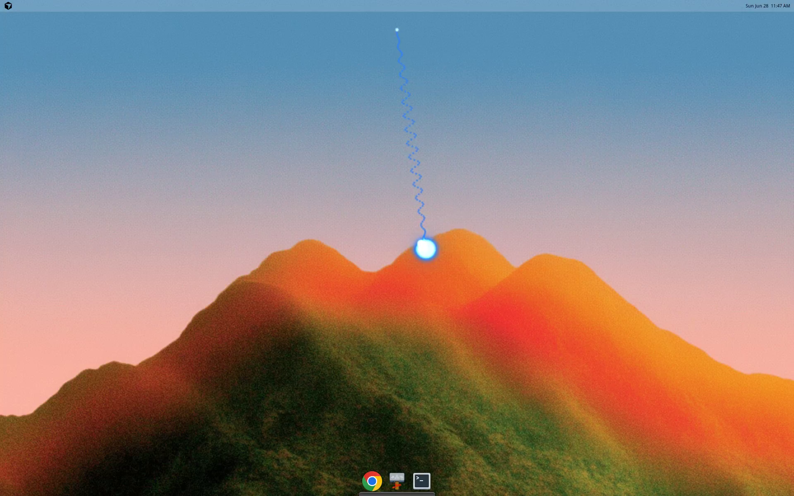
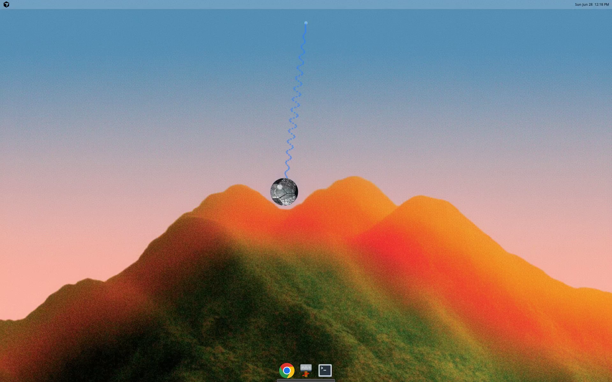
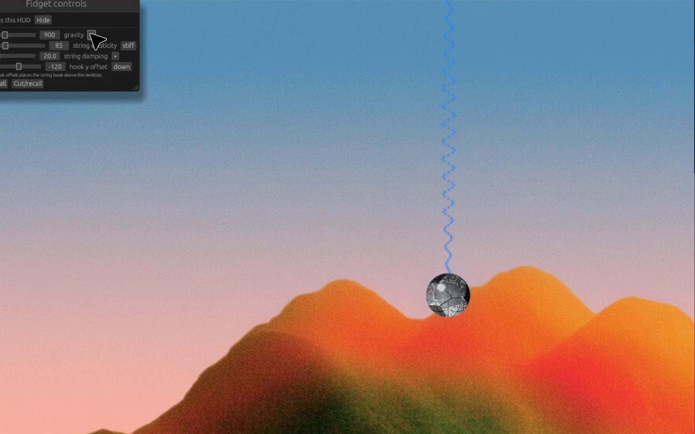

# Fidget-VK

Fidget-VK is a Vulkan-rendered desktop fidget toy: a textured ball hanging from
a spring that can be dragged, thrown, cut loose, recalled, and tangled with the
cursor.

The current app is a Linux transparent overlay preview built with Rust, winit,
ash/Vulkan, and egui. It also builds as a Windows preview executable, but the
Windows-specific shell work (Win32 click-through, tray icon, global hotkeys, and
native overlay behavior) is still planned.

## Screenshots

### Transparent full-desktop overlay



### Image-backed soccer ball material



### egui parameter HUD



## Features

- Full-desktop transparent Linux overlay preview.
- Vulkan rendering through `ash`.
- Image-backed soccer ball material with shader lighting and seam relief.
- Spring physics with gravity, damping, elasticity, and off-screen hook support.
- Cursor/string intersection that bends the spring and pushes the ball.
- Fast cursor sweeps can create temporary spring entanglement.
- Cut/recall behavior: release the ball, let it fall, then recall it to the spring.
- Motion trails, particles, impact sparks, squash/stretch, and glow.
- egui HUD for runtime tuning:
  - gravity
  - string elasticity/stiffness
  - string damping
  - hook Y offset
  - reset
  - cut/recall
- Linux, native Windows, and Linux-to-Windows cross-build CI.
- Release packaging for Linux and Windows zip assets.

## Controls

- Left drag: grab/throw the ball.
- Move cursor near string: displace the spring.
- Fast cursor sweep across string: temporary entanglement.
- Right click or `C`: cut/recall the spring.
- `N`: fling the ball.
- `G`: toggle gravity.
- `H`: show/hide the HUD.
- `R` or `Space`: reset the ball.
- `Esc`: quit.

## Build and test

### Linux

Install system dependencies:

```bash
sudo apt-get update
sudo apt-get install -y \
  glslang-tools \
  libvulkan1 \
  mesa-vulkan-drivers \
  pkg-config \
  libx11-dev \
  libxcb1-dev \
  libxkbcommon-dev \
  libxkbcommon-x11-dev \
  libwayland-dev \
  libxrandr-dev \
  libxi-dev \
  libxcursor-dev \
  libxinerama-dev
```

Build and run:

```bash
cargo build --release -p fidget-vk
./target/release/fidget-vk
```

Run checks:

```bash
cargo test -p fidget-sim
cargo clippy --workspace --all-targets -- -D warnings
```

### Windows cross-build from Linux/WSL

Install cross-build dependencies:

```bash
sudo apt-get install -y glslang-tools mingw-w64 gcc-mingw-w64-x86-64
```

Build the Windows executable:

```bash
tools/build-windows.sh
```

Output:

```text
target/x86_64-pc-windows-gnu/release/fidget-vk.exe
```

## GitHub Actions

The CI workflow runs on:

- pushes to `main`
- pushes to `cursor/**`
- pull requests targeting `main`
- published GitHub releases

Release builds upload zip packages:

- `fidget-vk-linux-x86_64.zip`
- `fidget-vk-windows-x86_64.zip`

The Windows cross-build job also uploads:

- `fidget-vk-windows-x86_64-cross.zip`

## Current status

Ready:

- Linux transparent overlay preview.
- Native Windows preview build.
- Linux-to-Windows GNU cross-compilation.
- CI and release packaging.

Planned:

- Native Win32 transparent overlay shell.
- Per-object click-through.
- System tray menu.
- Global hotkeys.
- Windows startup/install packaging.
