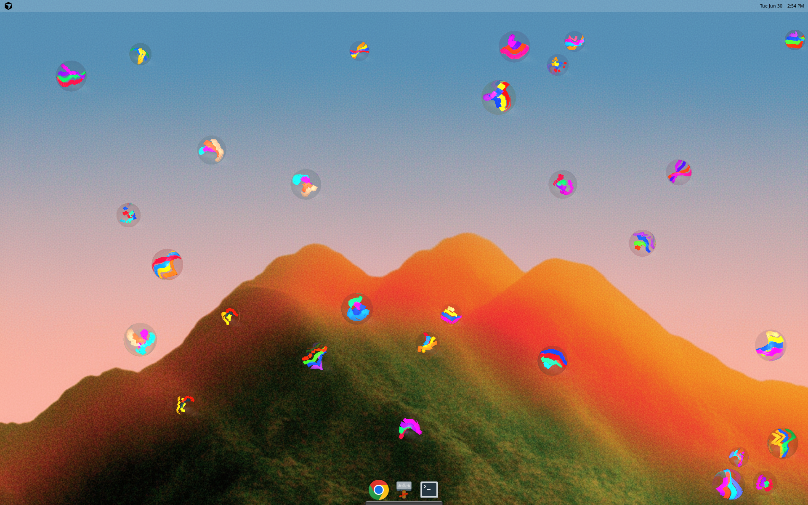
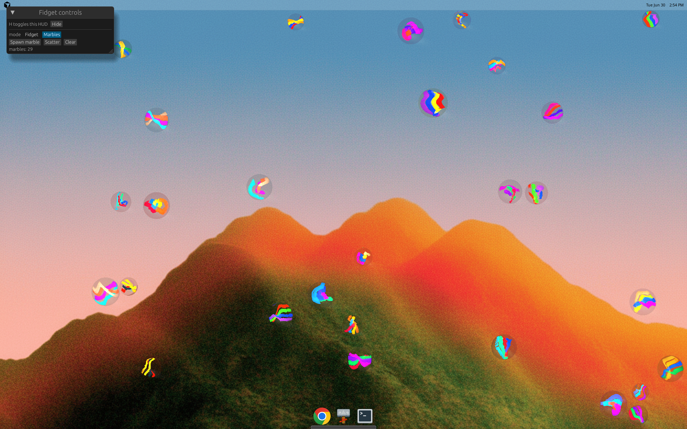
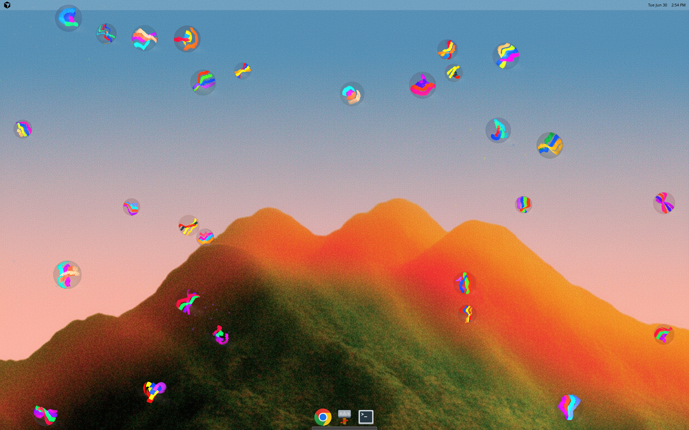

# Fidget-VK

**Your desktop is the playground.**

Fidget-VK sits on top of your wallpaper like a toy left on the table — always
there, always ready to mess with between tabs. No levels, no score, no timer.
Just satisfying physics you can poke at while the rest of your day happens
underneath.

## Fidget

A ball hangs from a spring anchored somewhere above the screen. Grab it and
throw it. Watch it bounce off the edges. Cut the string and let it drop into the
pit, then call it back. Hold right-click near the spring and push the line
around. Sweep fast enough and the cursor snags the string for a moment; sweep
even faster and you slice right through it.

Tune gravity, stiffness, and damping from the HUD until the swing feels exactly
right — heavy and lazy, or tight and snappy. Swap the string for a rubber band.
Fling it with `N` when you want chaos.

## Marbles

Press `P` and the spring toy steps aside. Your wallpaper becomes a marble table.

Spawn glass marbles — each one unique — and let them roll, collide, and spin
across the desktop. Grab one and throw it. Kick the pile with a right-click
sweep. Hit a wall hard enough and cracks spread across the surface; hit it harder
and the marble shatters into glass flecks. Scatter the lot with `N` and watch
the storm settle.

On Windows the toy lives in the system tray and stays out of your way until you
want it. On Linux it runs as a transparent full-screen overlay preview.

## Screenshots

### Transparent full-desktop overlay


### Image-backed soccer ball material


### egui parameter HUD


### Marbles mode on the desktop



### Marbles mode HUD



### Marbles scatter



## Controls

### Shared

- `P`: toggle Fidget / Marbles mode.
- `H`: show/hide the HUD.
- `Esc`: quit.
- `1` / `2` / `3`: small / medium / large toy size (marble radius range in
  Marbles mode).

### Fidget mode

- Left drag: grab/throw the ball.
- Hold right-click near string: grab/deflect the spring.
- Very fast right-click sweep across string: temporary entanglement until release.
- Very fast sweep across string: cut the spring.
- `C`: cut/recall the spring.
- `N`: fling the ball.
- `G`: toggle gravity.
- `R` or `Space`: reset the ball.

### Marbles mode

- Left drag: grab and throw a marble.
- Hold right-click and sweep: kick marbles (fast sweeps impart more damage).
- `O`: spawn a marble.
- `F`: scatter all marbles.
- `Delete`: clear all marbles.
- `N`: scatter/fling all marbles.
- `R` or `Space`: spawn a marble.

On Windows, the same actions are also available from the tray menu. Global
hotkeys use `Ctrl+Alt` plus the matching key, for example `Ctrl+Alt+H` for the
HUD, `Ctrl+Alt+P` to toggle mode, and `Ctrl+Alt+Esc` to quit.

## Build and test

### Linux

Install system dependencies:

```bash
sudo apt-get update
sudo apt-get install -y \
  glslang-tools \
  libvulkan1 \
  mesa-vulkan-drivers \
  pkg-config \
  libx11-dev \
  libxcb1-dev \
  libxkbcommon-dev \
  libxkbcommon-x11-dev \
  libwayland-dev \
  libxrandr-dev \
  libxi-dev \
  libxcursor-dev \
  libxinerama-dev
```

Build and run:

```bash
cargo build --release -p fidget-vk
./target/release/fidget-vk
```

Run checks:

```bash
cargo test -p fidget-sim
cargo clippy --workspace --all-targets -- -D warnings
```

### Windows cross-build from Linux/WSL

Install cross-build dependencies:

```bash
sudo apt-get install -y glslang-tools mingw-w64 gcc-mingw-w64-x86-64
```

Build the Windows executable:

```bash
tools/build-windows.sh
```

Output:

```text
target/x86_64-pc-windows-gnu/release/fidget-vk.exe
```

## GitHub Actions

The CI workflow runs on:

- pushes to `main`
- pushes to `cursor/**`
- pull requests targeting `main`
- published GitHub releases

Release builds upload zip packages:

- `fidget-vk-linux-x86_64.zip`
- `fidget-vk-windows-x86_64.zip`

The Windows cross-build job also uploads:

- `fidget-vk-windows-x86_64-cross.zip`

## Current status

Ready:

- Linux transparent overlay preview.
- Marbles mode with procedural glass marbles and shatter particles.
- Native Win32 transparent overlay shell.
- Per-object click-through on Windows.
- Windows system tray menu.
- Windows global hotkeys.
- Linux-to-Windows GNU cross-compilation.
- CI and release packaging.

Planned:

- Windows startup/install packaging.
